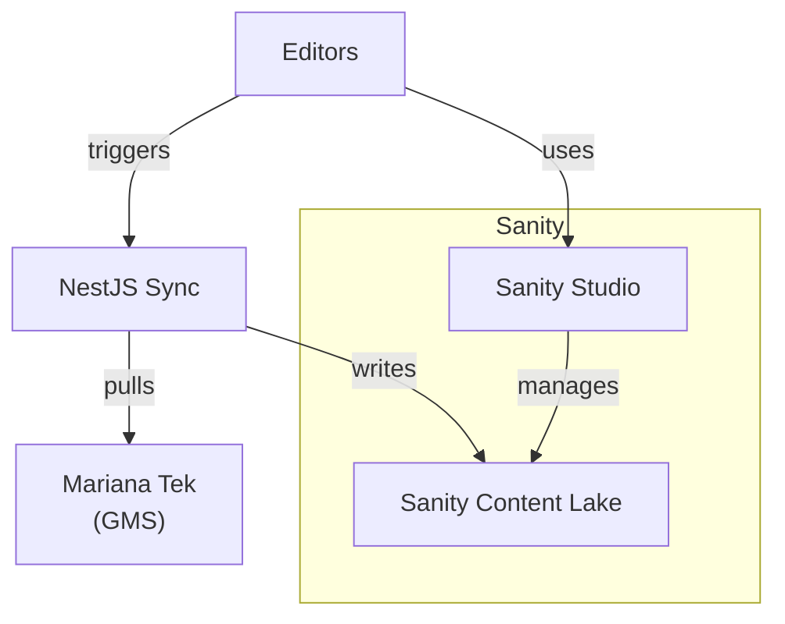
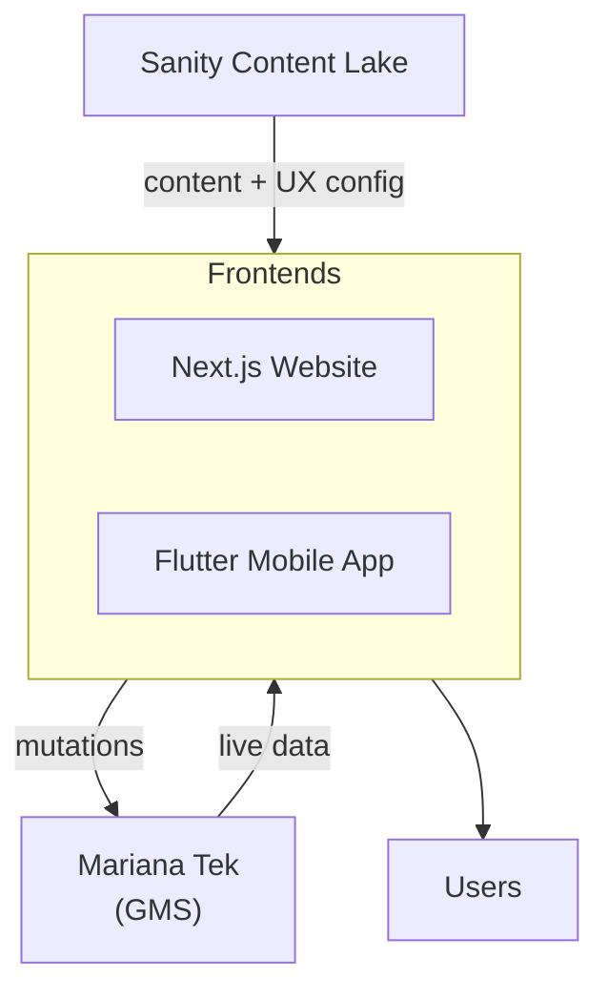
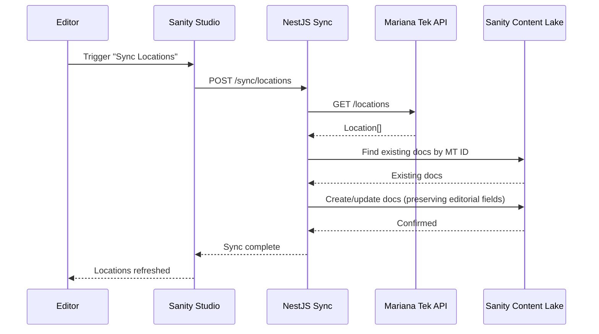
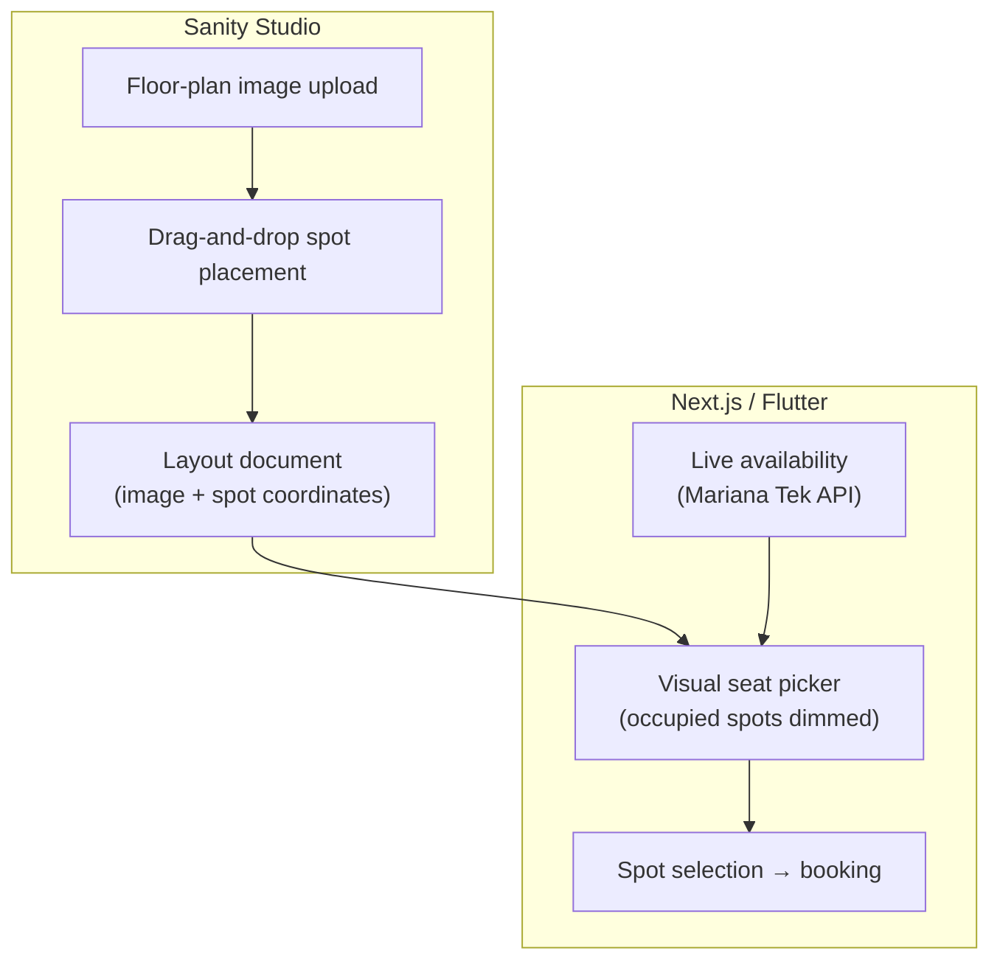

## Building a Premium Experience on Top of a GMS

A premium boutique gym with locations across two regions was migrating from ZingFit to Mariana Tek, a modern Gym Management System with strong operational capabilities: class scheduling, bookings, membership management. While Mariana Tek solved the backend, the client had a bigger ambition.

They wanted a digital presence that matched the premium feel of their physical spaces. Mariana Tek's bundled web builder offered basic theming (colors, logos, fonts) and could display operational data out of the box, but the client needed more: custom UI/UX, rich editorial content, and a brand experience that would set them apart in a competitive market. The GMS was capable at running the gym; what was missing was a presentation layer that felt like a premium fitness brand.

That is where we came in. Our brief was to build a fully custom, headless website and mobile app on top of Mariana Tek. But this was never just about a fresh coat of paint. Beyond the visual overhaul, we improved the experience of core gym business flows beyond what the out-of-the-box GMS supported: a visual seat picker that let users choose spots relative to trainers and equipment, a contextual class browser that surfaced relevant sessions wherever the user was on the site, and an on-demand sync pipeline that turned the GMS into an editorial data source. The GMS ran the gym; we built a premium experience around it.

## The Architecture

We introduced Sanity CMS as a parallel content layer alongside Mariana Tek. The two systems serve different concerns: Mariana Tek remains the source of truth for operational data (class schedules, availability, pricing), while Sanity owns all presentation content and UX configuration (toggles, feature flags, layout settings). Rich editorial pages, trainer profiles, location details, class-type promotions, and behavioral controls are authored in Sanity's Studio.

A NestJS synchronization service bridges the two. When the client creates or updates source information in Mariana Tek, they trigger a sync from Sanity Studio to pull that data into Sanity. Once synced, the entities can be enriched with editorial fields: hero images, rich text descriptions, promotional callouts, and custom page sections.

The frontends, a Next.js website and a Flutter mobile app, query both systems directly, assembling pages from Sanity's content layer and Mariana Tek's live operational data.

## Feature Breakdown

The build started with a flexible page builder. Editors compose rich pages from custom UI blocks: hero sections, CTAs, image carousels, richtext, and anything else needed to catch eyes and convert sales. The brand team controls every page without developer intervention. On top of this foundation, four features tackle the gym's specific business flows:

- **The sync pipeline:** on-demand entity sync from GMS to CMS with editorial enrichment
- **Custom seat picker:** visual spot booking with a drag-and-drop layout editor in Sanity
- **Contextual class list:** a reusable, Suspense-wrapped component that filters by page context
- **Multi-region deployment:** a single codebase serving two independent domains

### The Sync Pipeline

Mariana Tek already stored rich information about each entity: locations had names and addresses, trainers had bios and photos, class types had descriptions. But the GMS's built-in editor limited how that content could be presented. Editors could write text and upload images, but they could not compose premium layouts with custom blocks, CTAs, or brand-aligned styling.

The sync pipeline turned Mariana Tek into an editorial data source. When the client created or updated an entity in the GMS, they opened Sanity Studio and triggered a sync. The NestJS service pulled the entity's core fields from Mariana Tek, matched them against existing Sanity documents by MT ID, and created or updated as needed. Once synced, editors enriched each document with Sanity's full page builder: hero images, promotional callouts, custom page sections, and any other block the brand needed.

The sync was non-destructive. Editorial content already authored in Sanity was never overwritten. Only the core fields from the GMS (name, description, photo) were refreshed. Editors could safely iterate on their premium content while the operational data stayed in sync.

A custom UI inside Sanity Studio gave editors a sync trigger per entity type: locations, trainers, class types, and class layouts. Clicking "Sync Locations" pulled all locations from Mariana Tek and refreshed the corresponding Sanity documents in one action.

The diagram above shows a simplified flow for a single entity type. In practice, editors could sync multiple entity types in parallel with a single action, and the NestJS service handled each type concurrently.

### The Custom Seat Picker

Mariana Tek's seat booking displayed spots arranged on a shape, which worked for simple single-room layouts. But the available shapes were fixed; adding a new layout meant requesting it from Mariana Tek's team, and turnaround could take time. Even with a matching shape, the visual was basic. The gym had multiple floors with distinct layouts, landmarks, and equipment zones that a plain shape could not convey.

We built a visual seat-picker that maps spots onto actual floor-plan images. Editors upload a floor-plan photo or diagram in Sanity Studio and place spot markers on it using a custom drag-and-drop input component, positioning each marker relative to walls, trainers, equipment, and exits. Each marker links to a spot ID in Mariana Tek, so live availability still comes from the GMS at booking time. The frontend renders the layout with occupied spots dimmed and available spots tappable, giving users a clear sense of where they are booking, on which floor, next to what.

The custom input was built as a Sanity custom component, giving editors full visual control over classroom layouts without touching code. The same seat-picker component shipped on both web and mobile, maintaining a consistent booking experience across platforms.

### The Contextual Class List

The GMS default class browser forced users through a rigid funnel: select country, then select gym location, then browse classes. It worked as a utility but failed as a discovery tool. Users of boutique gyms often follow specific trainers, locations, or class types. A linear filter path buries that intent.

We built a unified class list component that adapts its filter context based on the page it lives on:

- **Location detail pages** show classes for that gym
- **Trainer profiles** filter to that trainer's upcoming sessions
- **Class-type (concept) pages** narrow to sessions of that type

The component uses React Suspense with skeleton loading states, so each section of the page streams in independently without blocking the others.

This turned the class list from a utility into an upsell surface. A user reading about a trainer sees that trainer's classes without navigating away. A user exploring a class type sees where and when it's offered. The component was embedded across gym detail pages, trainer profiles, and concept pages, each instance a self-contained data island that fetched from both Mariana Tek (schedule data) and Sanity (enriched presentation content).

### Multi-Region Deployment

The gym operated in two regions, London and Australia, each with its own domain. Rather than fork the codebase, we designed every layer to support multiple deployments from a single repository.

The same Next.js, Flutter, Sanity, and NestJS codebases deployed twice, pointed at different Mariana Tek tenants and separate Sanity projects. Build-time configuration swapped domain names, API endpoints, and brand assets. The sync service routed to the correct GMS instance based on environment variables. Both regions shared the same feature set, updated simultaneously from the same codebase.

## Lessons Learned

One architectural call proved expensive: having both the Next.js website and the Flutter app query Mariana Tek and Sanity independently. The goal was to avoid a single point of failure by removing an intermediate backend, but the trade-off was doubled integration effort. Every new feature that consumed GMS data had to be implemented twice: once in the web app's data layer and once in Flutter's. If we were starting again, a thin API gateway between the frontends and the two data sources would have been the right call.
