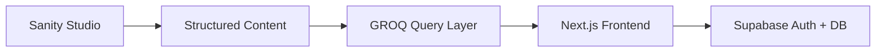
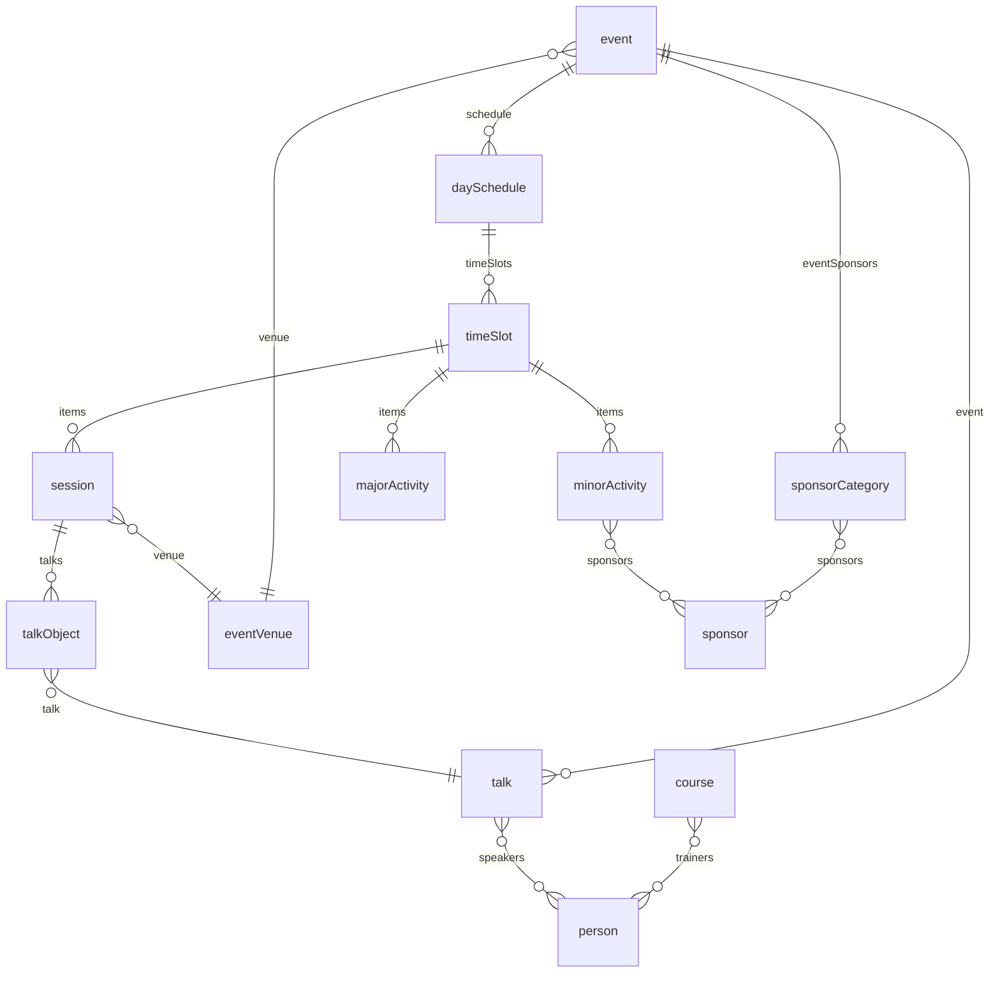
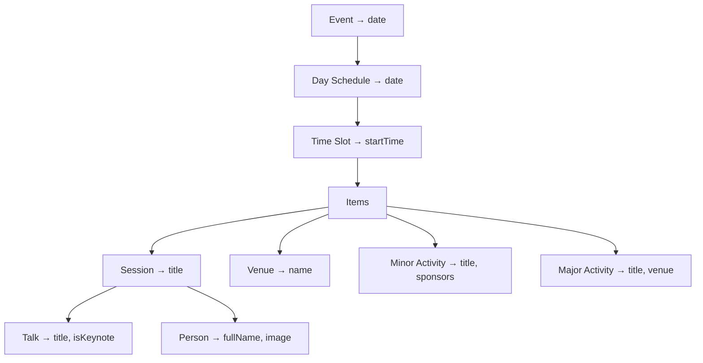

**Role:** Lead Developer &amp; Architect

**Stack:** Sanity CMS, Next.js, GROQ, Supabase, TypeScript

**Outcome:** Maintainers reduced from 15–20 to 2–3. New events launched in one week instead of two to three.

---

### The Problem: A CMS That Created More Friction Than Freedom

brightonSEO is the world's largest search marketing conference. Behind the scenes, their event management ran on a loose WordPress setup that had grown organically over years with no consistent structure. Content was scattered across pages, posts, and plugins with no unified model tying it together. There was no concept of an "event" as a data entity — just pages that happened to describe one.

Every new conference meant hiring 15–20 freelancers to manually wipe site content and re-enter everything from scratch. Old events simply disappeared — there was no archive. The schedule, speaker bios, sponsor lists, and course descriptions all lived as free-form HTML, making them unsearchable, unlinked, and impossible to reuse across event editions.

The team needed to go from "a collection of pages about events" to "a platform that understands events as structured data."

---

### The Architecture

We migrated the entire content stack to Sanity CMS with a Next.js frontend, choosing Sanity for its flexibility and stability in modeling complex, deeply relational content. GROQ queries handled the heavy data assembly server-side, while Supabase provided authentication and a user database for the personalized features.

---

### Feature Breakdown

#### Designing a Flexible Event Model (The Hardest Problem)

The most difficult part of the project was not any single feature — it was designing a schema that could represent events the client hadn't yet imagined. The existing system offered no reference point for what structured event data should look like, so requirements came in at a high level. We had to build a data model that was flexible enough to accommodate unknown future configurations while staying intuitive for a non-technical editorial team.

A talk can belong to multiple speakers, a session contains multiple talks, and an event's schedule is a nested tree of days, time slots, and activities — all queryable through Sanity's GROQ language in a single round-trip.

#### Schedule Table: Six Levels of Data in One Query

The schedule table assembles data from six entity levels into a single view. A row showing "09:00 — The Future of SEO — Jane Smith — Room A" pulls from Event (date), TimeSlot (startTime), Session (title), Venue (room), Talk (title, keynote flag), and Person (name, photo) — all resolved by one GROQ query:

Writing this GROQ query was the most technically challenging part of the build. At the time, Sanity was relatively new and we were early adopters — getting the nested traversal, conditional expansion of three different item types, and sponsor resolution right involved extensive trial and error.

#### Page Builder: Sections That Work Anywhere

We built a block-based page builder in Sanity that lets the client compose landing pages, event pages, and course pages without developer intervention. The key decision: business-critical sections like the schedule table are not hard-coded to a specific page. They exist as reusable blocks that editors can drop onto any page — an event landing page, a dedicated schedule page, or a sponsor section — with the same GROQ query resolving all the data regardless of placement.

Navigation followed the same principle: the client can add, remove, and reorder links entirely from the CMS, no code changes needed.

#### My-Schedule: Personalized Event Planning

A feature the conference had never offered before: attendees can browse the schedule, bookmark sessions and talks, and build a personal agenda. We used Supabase for authentication and as the user database, keeping the personalization layer separate from Sanity's content store. The schedule data still comes from Sanity via GROQ; Supabase only tracks which items each user has saved, generating a downloadable PDF schedule on demand.

---

### Reflections

The schema held up well, but here is what I'd approach differently with hindsight:

- **Event editions as first-class entities.** The data model grew around the *current* event's needs. A cleaner foundation would treat "event season" or "event edition" as the top-level grouping from day one, with talks, sessions, and sponsors scoped underneath it — eliminating the need for shortcuts like `talk.event` to patch queries.

- **Venue naming.** Both `event.venue` (the conference center) and `session.venue` (a specific room) shared the same field name. Distinguishing these — e.g., `session.room` — would make the schema self-documenting for new developers and clarify GROQ queries.

- **Sponsor data paths.** Sponsors could be configured at the event level (via `sponsorCategory`) and at the individual activity level (via `minorActivity.sponsors`). Two separate query paths for the same conceptual data added complexity. A unified model where activities reference event-level sponsors would simplify both schema and front-end logic.

- **Query decomposition.** The monolithic schedule table GROQ query could be broken into smaller, composable queries today. Next.js's cache layer would handle the assembly, trading one fragile mega-query for several focused ones with better cacheability.

---

### Outcome

- **Maintainers reduced from 15–20 to 2–3.** Content editors manage the entire site directly in Sanity without developer help.
- **Event launch time cut by more than half:** new conferences go live in one week instead of two to three.
- **Complete creative freedom** for the client to compose rich, visually expressive pages with a drag-and-drop page builder.
- **First-ever personalized attendee experience** with My-Schedule, powered by Supabase authentication.
