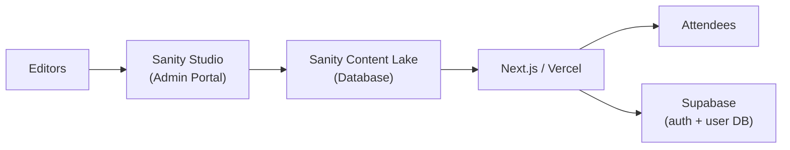
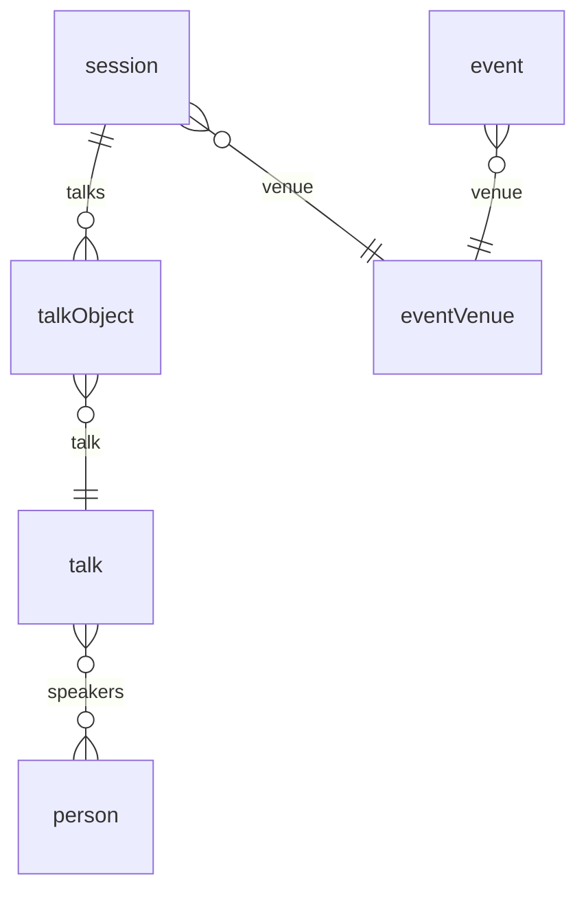
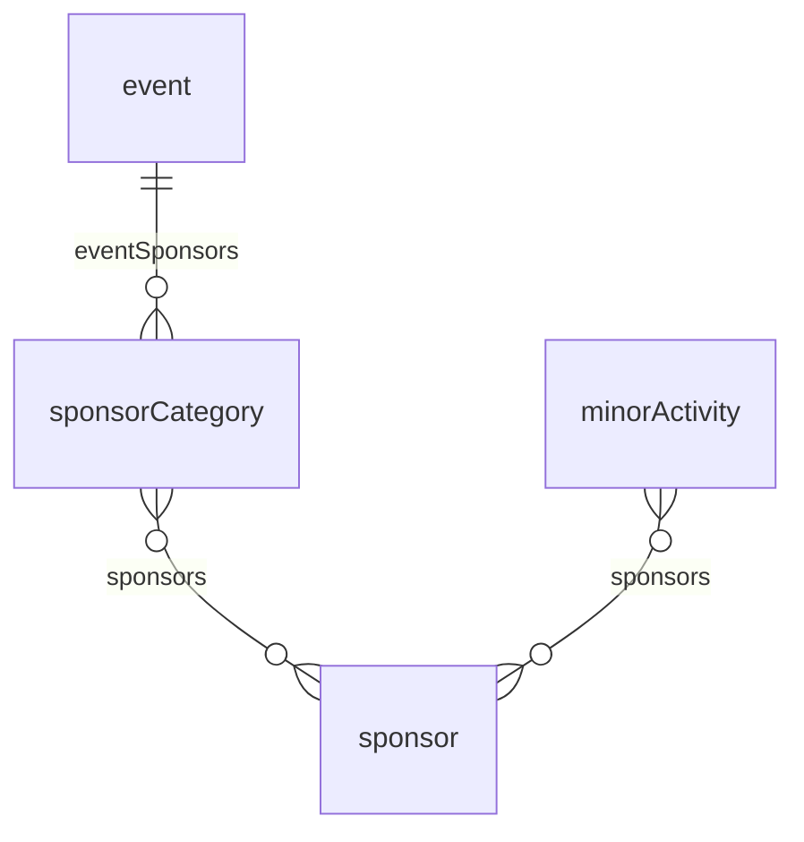
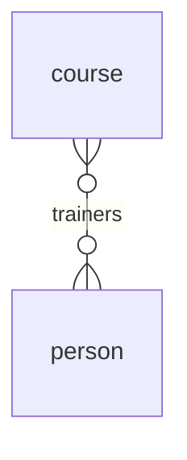
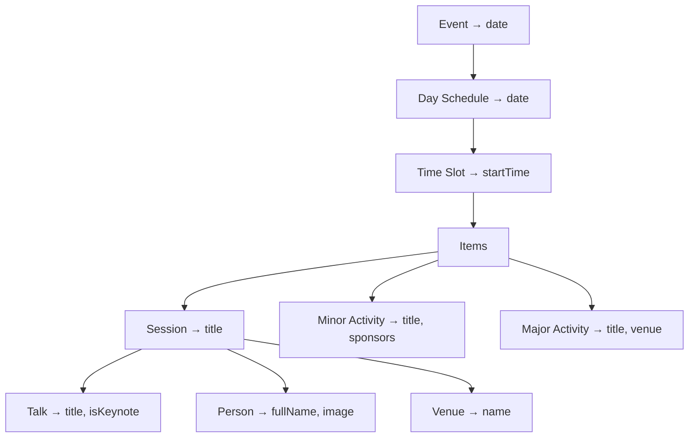

## The Problem: Outgrowing a Page-Based Content Structure

brightonSEO is the world's largest search marketing conference. Behind the scenes, their event management had grown organically alongside the conference itself: a WordPress setup that had served them well through years of expansion. But the content model had kept pace with the conference by adding pages, not by adding structure. Every entity — schedule, speakers, sponsors, courses — was a hand-authored page. There was no notion of an "event" as data, just pages that described one.

As the conference scaled, this page-based workflow became the bottleneck. Each edition required a large team to rebuild the site by hand, with no structured way to carry prior work forward. Content that should have been reusable — speaker bios, talk descriptions, sponsor profiles — had to be recreated every time. Past events faded into disconnected archives, if they were preserved at all.

The editorial vision was there. What was missing was a system that could express it in structured, reusable terms. The team needed to go from "a collection of pages about events" to "a platform that understands events as data."

## The Architecture

We migrated the entire content stack to Sanity CMS with a Next.js frontend. Content editors work in Sanity Studio (the admin portal), where every entity—event, talk, speaker, sponsor—is modeled as structured content. GROQ queries assemble the relational data server-side; one query can traverse six levels of nesting. The Next.js frontend renders the results, while Supabase provides authentication and a user database for the personalized features.

## Feature Breakdown

With the architecture in place, the build centered on four major features: the data model, the schedule table, the page builder, and attendee personalization.

### Designing a Flexible Event Model (The Hardest Problem)

The most difficult part of the project was not any single feature. It was designing a schema that could represent events the client had not yet imagined. The existing system offered no reference point for what structured event data should look like, so requirements came in at a high level. We had to build a data model that was flexible enough to accommodate unknown future configurations while staying intuitive for a non-technical editorial team.

### The Schedule Chain

An event is a nested tree: days contain time slots, and each time slot can hold one of three activity types.

- **Event:** a single conference edition (e.g., brightonSEO October 2024). All content—schedule, talks, sponsors—is scoped to an event.
- **Day Schedule:** one day of an event's multi-day schedule. Each day is an ordered list of time slots.
- **Time Slot:** a block of time (e.g., 09:00–09:30). The branching point for the three activity types below.
- **Session:** a scheduled talk, panel, or keynote. Contains talk objects and is assigned to a venue.
- **Minor Activity:** a sponsor event, break, or networking session. Shorter duration, can reference sponsors directly.
- **Major Activity:** a premium keynote or headline session, rendered with visual emphasis in the schedule.

By nesting the schedule as a tree rather than a flat list, editors could add or remove days and time slots without restructuring anything. The GROQ query simply traverses the tree depth-first to build the table.

### Talks, Speakers, and Venues

A session contains talks, talks have speakers, and both sessions and events need physical locations. Decoupling these into separate entities was critical: a single talk like "The Future of SEO" can appear across multiple sessions and events, and a speaker can give multiple talks.

- **Talk Object:** a join table linking a session to a talk, carrying ordering and metadata for that specific slot.
- **Talk:** the reusable talk entity with title, description, and keynote flag. Exists once in the database, referenced everywhere it is given.
- **Person:** a speaker, trainer, or contributor. Many-to-many with talks and courses.
- **Event Venue:** used at two levels: `event.venue` is the conference center, `session.venue` is a specific room. Same entity type, two different scopes.

### Sponsors

Sponsors attach at two independent levels: event-wide sponsor categories for the main sponsor page, and individual activity spots for sponsor spotlights within the schedule.

- **Sponsor Category:** groups sponsors by tier (platinum, gold, silver). An event has multiple sponsor categories.
- **Sponsor:** a company or organization, referenced from both sponsor categories and minor activities. Having two separate query paths for the same entity added complexity, which I would revisit in hindsight.

### Courses

Training courses run alongside the main conference schedule, reusing the same person pool as talks.

- **Course:** a training course with one or more trainers (persons). A single Person entity powers both speakers (in talks) and trainers (in courses), so the client manages one speaker pool across the entire site. Courses run alongside the main conference schedule, sharing the same event scoping.

### Schedule Table: Six Levels of Data in One Query

The schedule table assembles data from six entity levels into a single view. A row showing "09:00 — The Future of SEO — Jane Smith — Room A" pulls from Event (date), TimeSlot (startTime), Session (title), Venue (room), Talk (title, keynote flag), and Person (name, photo). All of it resolved by one GROQ query:

Writing this GROQ query was the most technically challenging part of the build. At the time, Sanity was relatively new and we were early adopters. Getting the nested traversal, conditional expansion of three different item types, and sponsor resolution right involved extensive trial and error.

### Page Builder: Sections That Work Anywhere

We built a block-based page builder in Sanity that lets the client compose landing pages, event pages, and course pages without developer intervention. The key decision: business-critical sections like the schedule table are not hard-coded to a specific page. They exist as reusable blocks that editors can drop onto any page—an event landing page, a dedicated schedule page, or a sponsor section—with the same GROQ query resolving all the data regardless of placement.

### My-Schedule: Personalized Event Planning

This was a feature the conference had never offered before. Attendees can browse the schedule, bookmark sessions and talks, and build a personal agenda. We used Supabase for authentication and as the user database, keeping the personalization layer separate from Sanity's content store. The schedule data still comes from Sanity via GROQ; Supabase only tracks which items each user has saved, generating a downloadable PDF schedule on demand.

### Outcome

- **Site Maintainers:** reduced from 15–20 to 2–3
- **Event Setup:** new events launched in one week instead of two to three

### Reflections

The schema held up well, but here is what I would approach differently with hindsight:

- **Event editions as first-class entities.** The data model grew around the _current_ event's needs. A cleaner foundation would treat "event season" or "event edition" as the top-level grouping from day one, with talks, sessions, and sponsors scoped underneath it. That would eliminate the need for shortcuts like `talk.event` to patch queries.

- **Venue naming.** Both `event.venue` (the conference center) and `session.venue` (a specific room) shared the same field name. Distinguishing these—for example, `session.room`—would make the schema self-documenting for new developers and clarify GROQ queries.

- **Sponsor data paths.** Sponsors could be configured at the event level (via `sponsor_category`) and at the individual activity level (via `minor_activity.sponsors`). Two separate query paths for the same conceptual data added complexity. A unified model where activities reference event-level sponsors would simplify both schema and front-end logic.

- **Query decomposition.** The monolithic schedule table GROQ query could be broken into smaller, composable queries today. Next.js's cache layer would handle the assembly, trading one fragile mega-query for several focused ones with better cacheability.
