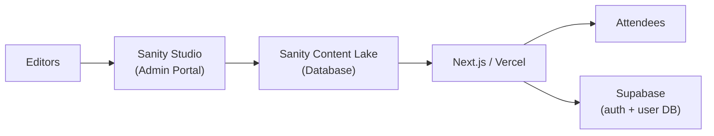
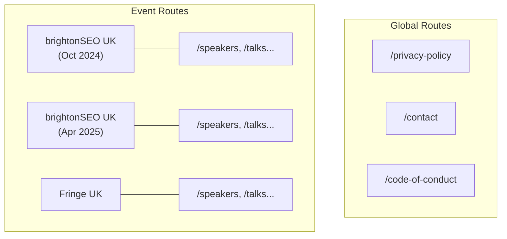
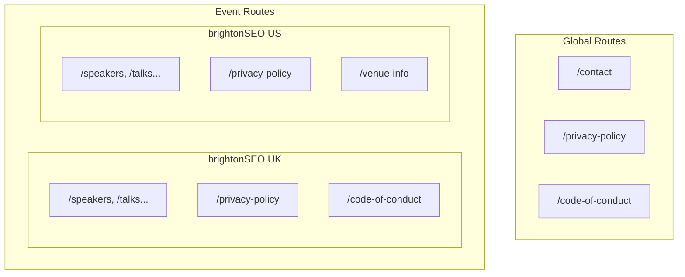
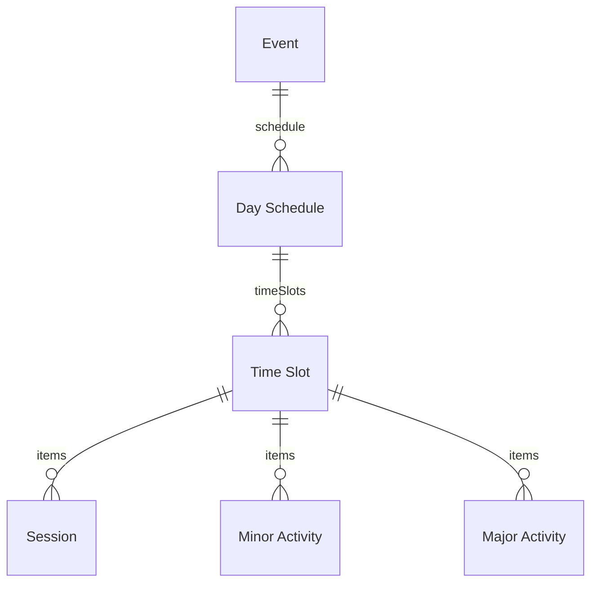
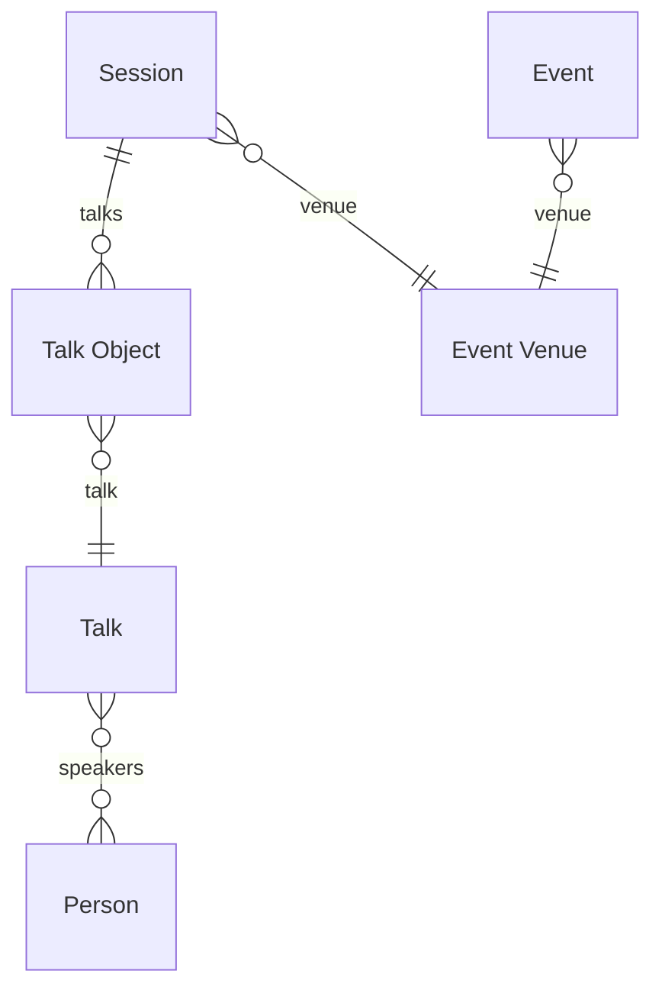
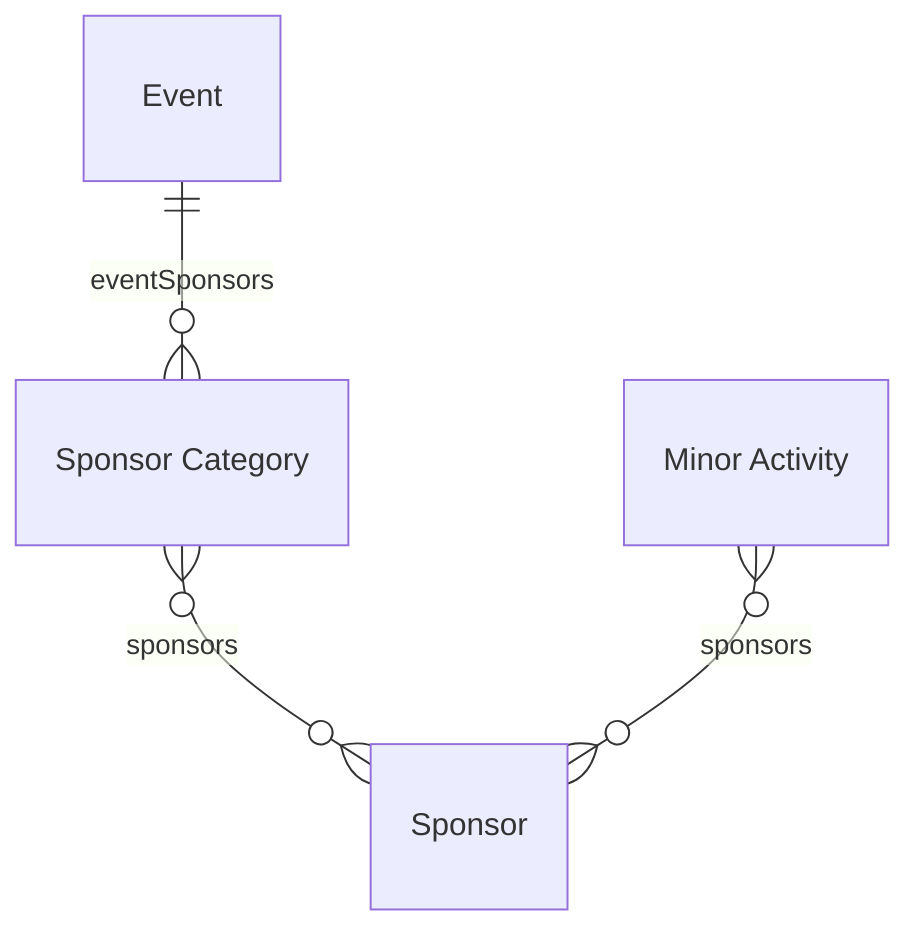
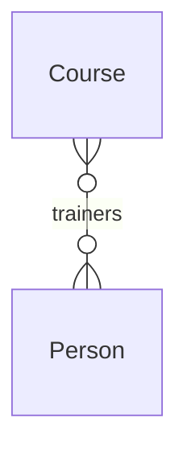
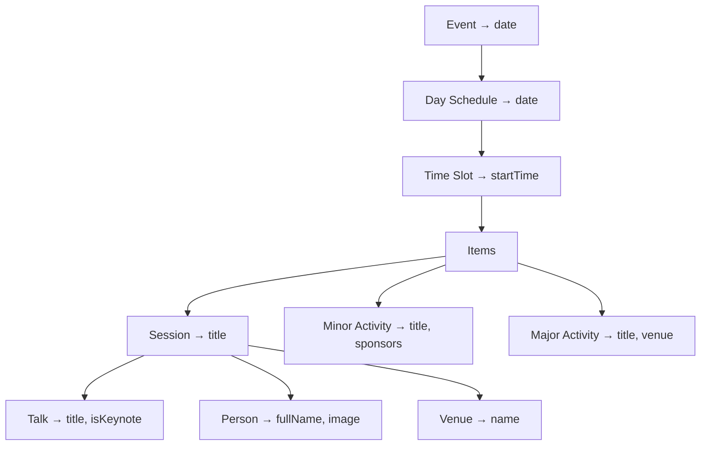

## The Problem: Outgrowing a Page-Based Content Structure

brightonSEO is the world's largest search marketing conference. Behind the scenes, their event management had grown organically alongside the conference itself: a WordPress setup that had served them well through years of expansion. But the content model had kept pace with the conference by adding pages, not by adding structure. Every entity — schedule, speakers, sponsors, courses — was a hand-authored page. There was no notion of an "event" as data, just pages that described one.

As the conference scaled, this page-based workflow became the bottleneck. Each edition required a large team to rebuild the site by hand, with no structured way to carry prior work forward. Content that should have been reusable — speaker bios, talk descriptions, sponsor profiles — had to be recreated every time. Past events faded into disconnected archives, if they were preserved at all.

The editorial vision was there. What was missing was a system that could express it in structured, reusable terms. The team needed to go from "a collection of pages about events" to "a platform that understands events as data."

## The Architecture

We migrated the entire content stack to Sanity CMS with a Next.js frontend. Every entity — event, talk, speaker, sponsor — is modeled as structured content inside Sanity. Editors manage everything from Sanity Studio, a purpose-built admin portal that reflects their editorial workflow rather than a generic CMS interface.

GROQ queries assemble the relational data server-side. The schedule table alone traverses six levels of nested data in a single query, resolving event dates, time slots, session titles, talk details, speaker names, and venue assignments before the page reaches the browser.

The Next.js frontend handles both static pages and dynamic content like the personalized agenda. Supabase is strictly for end-user personalization: authentication and a database for saved schedules. All content still comes from Sanity via GROQ.

## Feature Breakdown

With the architecture in place, the build centered on five major features:

- **The data model** — a flexible schema for events the client hadn't yet imagined
- **Multi-region support** — one Studio, multiple countries, no data migration
- **The schedule table** — six levels of data resolved in a single query
- **The page builder** — reusable blocks editors can compose without developers
- **Attendee personalization** — saved schedules and downloadable PDFs

### Designing a Flexible Event Model

The hardest part of the project was not any single feature. It was designing a schema that could represent events the client had not yet imagined.

The client came to us with a high-level overview of how their events ran. But when we examined their existing site and dug through years of old PDF event schedules, the picture was more complex. Two events of the same type often had different formats. Sessions, talks, and activities were organized differently across editions with no clear pattern. The client had deep institutional knowledge, but it had never been formalized into a structure.

We decided to reverse-engineer their decision-making. For each type of event, each session format, and each activity variant, we quizzed them on why a particular edition was structured the way it was. What was spontaneous? What was deliberate? These conversations surfaced reasoning they had never articulated before, and gave us the raw material for a schema that reflected their actual operations rather than just the latest event.

We also had to look beyond what they were currently running. The client talked about two event formats - brightonSEO and Fringe - but we hadn't yet internalized what that meant for the schema. Our first attempt scoped document types specifically to brightonSEO or Fringe, assuming those categories were stable. We quickly saw the problem: if a third format arrived or an old one retired, the entire schema would need refactoring. We scrapped that approach and shifted to a general model where an event's format emerged from its configuration rather than its document type. An event was just an event; brightonSEO and Fringe were simply two instances of it.

For the Sanity Studio experience, we followed Sanity's best practices: grouping related concerns into dedicated folders in the sidebar, using labels that read naturally to a non-technical editor while keeping the underlying field names developer-centric. It worked, but not perfectly. Given more time, I would have refined the Studio layout further to better match the editorial team's mental model.

### Going Global: One Studio, Multiple Countries

When brightonSEO expanded to the US and began planning European events, the shift to a general event model had an unexpected payoff. Because an event was no longer tied to a specific format like brightonSEO or Fringe, adding a new country was no different from adding a new edition. The schema already treated events as generic containers with a venue country; we just needed to let other documents live inside them.

Before, every general page lived at the global route. Events could only host entity pages. Multiple events ran sequentially - never at the same time - because they were all in the same region.

Two things unlocked the shift.

First, we gave every general page an optional link to an event. Pages linked to an event render under that event's route. Pages without the link stay at the global level.

Second, we added a new route in Next.js that catches any page assigned to an event. A GROQ query filters for pages linked to the current event, and all event-scoped pages are pre-rendered at build time.

Both the Sanity document types and the GROQ queries remained the same. No data was migrated. Existing global pages stayed global. The same Studio the editorial team already knew now managed three countries. The entire feature was built in one month by two developers.

### The Event Data Model

An event is a nested tree: days contain time slots, and each time slot can hold one of three activity types.

- **Event:** a single conference edition. Contains a title, start and end dates, a venue (which carries the country), a schedule made of day schedules, and content to build the event's home page - hero, page sections, sponsor categories, header, and footer.
- **Day Schedule:** one day of the multi-day schedule. Holds a date and an ordered list of time slots.
- **Time Slot:** a block of time with a start time. Can hold multiple concurrent items. The item types are:
  - **Session**: a scheduled talk or panel. Contains a title, an ordered list of talk objects, a venue, and optional page sections.
  - **Minor Activity**: a break, networking session, or sponsored event. Has a title, an optional rich text description, and an optional list of sponsors. When placed in a time slot, it carries a free-text duration the editor can customize.
  - **Major Activity**: a standalone event-within-an-event, added during this build. Carries its own title, a required hero image, and a list of content blocks - each with a location, time range, and page sections.

By nesting the schedule as a tree rather than a flat list, editors could add or remove days and time slots without restructuring anything. Days, time slots, and activities are just nodes in the tree - add one, remove one, reorder them, and the rest stays intact.

### Talks, Speakers, and Venues

A session contains talks, talks have speakers, and both sessions and events need physical locations. Decoupling these into separate entities was critical: a single talk like "The Future of SEO" can appear across multiple sessions and events, and a speaker can give multiple talks.

- **Talk Object:** a join table linking a session to a talk, carrying ordering and metadata for that specific slot.
- **Talk:** the reusable talk entity with title, description, and keynote flag. Exists once in the database, referenced everywhere it is given.
- **Person:** a speaker, trainer, or contributor. Many-to-many with talks and courses.
- **Event Venue:** used at two levels: `event.venue` is the conference center, `session.venue` is a specific room. Same entity type, two different scopes.

### Sponsors

Sponsors attach at two independent levels: event-wide sponsor categories for the main sponsor page, and individual activity spots for sponsor spotlights within the schedule.

- **Sponsor Category:** groups sponsors by tier (platinum, gold, silver). An event has multiple sponsor categories.
- **Sponsor:** a company or organization, referenced from both sponsor categories and minor activities. Having two separate query paths for the same entity added complexity, which I would revisit in hindsight.

### Courses

Training courses run alongside the main conference schedule, reusing the same person pool as talks.

- **Course:** a training course with one or more trainers (persons). A single Person entity powers both speakers (in talks) and trainers (in courses), so the client manages one speaker pool across the entire site. Courses run alongside the main conference schedule, sharing the same event scoping.

### Schedule Table: Six Levels of Data in One Query

The schedule table assembles data from six entity levels into a single view. A row showing "09:00 · The Future of SEO · Jane Smith · Room A" pulls from Event (date), TimeSlot (startTime), Session (title), Venue (room), Talk (title, keynote flag), and Person (name, photo). All of it resolved by one GROQ query:

Writing this GROQ query was the most technically challenging part of the build. At the time, Sanity was relatively new and we were early adopters. Getting the nested traversal, conditional expansion of three different item types, and sponsor resolution right involved extensive trial and error.

### Page Builder: Sections That Work Anywhere

We built a block-based page builder in Sanity that lets the client compose landing pages, event pages, and course pages without developer intervention. The key decision: business-critical sections like the schedule table are not hard-coded to a specific page. They exist as reusable blocks that editors can drop onto any page (an event landing page, a dedicated schedule page, or a sponsor section) with the same GROQ query resolving all the data regardless of placement.

### My-Schedule: Personalized Event Planning

This was a feature the conference had never offered before. Attendees can browse the schedule, bookmark sessions and talks, and build a personal agenda. We used Supabase for authentication and as the user database, keeping the personalization layer separate from Sanity's content store. The schedule data still comes from Sanity via GROQ; Supabase only tracks which items each user has saved, generating a downloadable PDF schedule on demand.

### Outcome

- **Site Maintainers:** reduced from 15–20 to 2–3
- **Event Setup:** new events launched in one week instead of two to three

### Reflections

The schema held up well, but here is what I would approach differently with hindsight:

- **Event editions as first-class entities.** The data model grew around the _current_ event's needs. A cleaner foundation would treat "event season" or "event edition" as the top-level grouping from day one, with talks, sessions, and sponsors scoped underneath it. That would eliminate the need for shortcuts like `talk.event` to patch queries.

- **Venue naming.** Both `event.venue` (the conference center) and `session.venue` (a specific room) shared the same field name. Distinguishing these (for example, `session.room`) would make the schema self-documenting for new developers and clarify GROQ queries.

- **Sponsor data paths.** Sponsors could be configured at the event level (via `sponsor_category`) and at the individual activity level (via `minor_activity.sponsors`). Two separate query paths for the same conceptual data added complexity. A unified model where activities reference event-level sponsors would simplify both schema and front-end logic.

- **Query decomposition.** The monolithic schedule table GROQ query could be broken into smaller, composable queries today. Next.js's cache layer would handle the assembly, trading one fragile mega-query for several focused ones with better cacheability.
