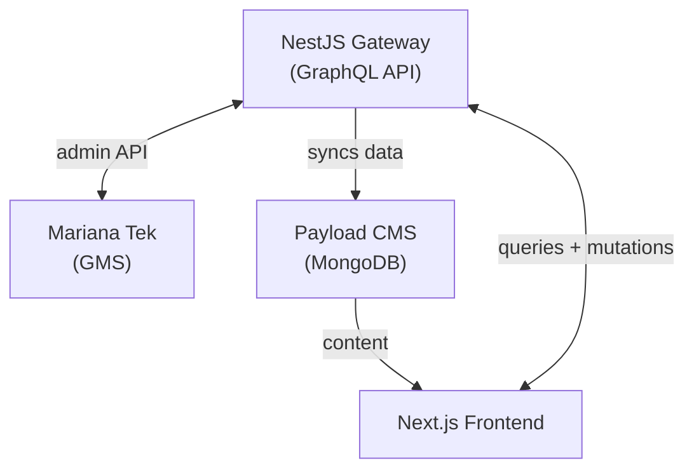
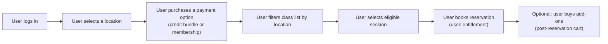
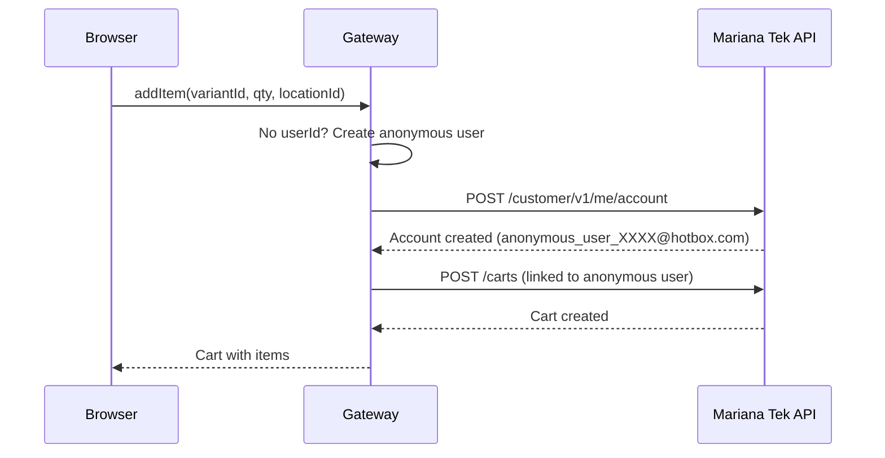
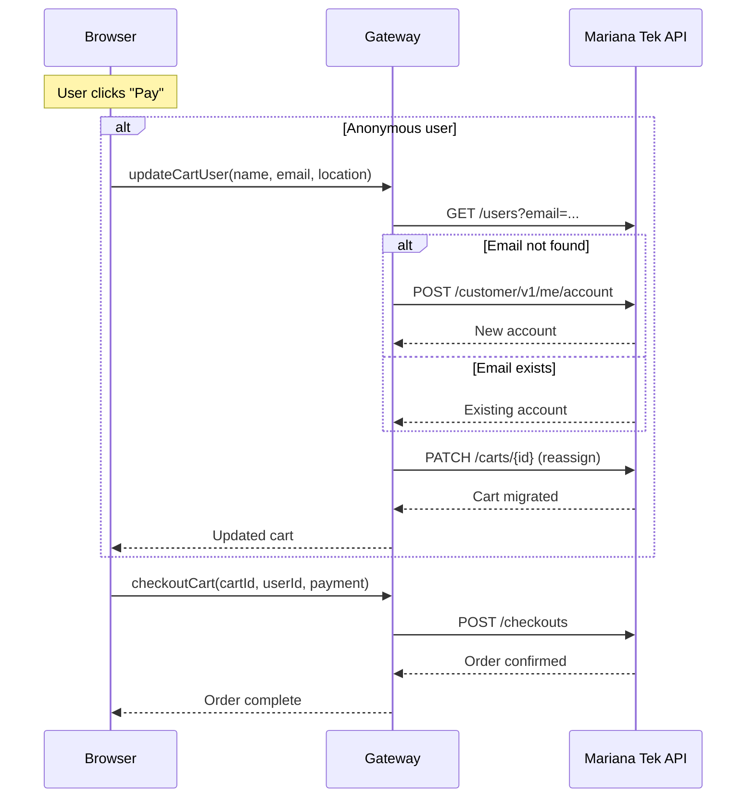

A sauna business operating across multiple locations in Ireland needed to move their bookings and sales into Mariana Tek, a Gym Management System that handles class scheduling, reservations, memberships, and payments. The client wanted the operational backbone of a GMS with a premium customer experience.

I was the lead developer on this project over 6 months. The brief was to build a custom booking website on top of Mariana Tek that would let customers browse, book, and pay without the friction the platform enforces by default. That meant no mandatory login, no forced membership purchases, and no single-spot booking limitation. Walk-in customers had to move through the site as smoothly as members.

## The Architecture

A NestJS gateway sits between the Next.js frontend and Mariana Tek. It exposes a GraphQL API that the frontend consumes for all booking, cart, and checkout operations. The gateway also syncs relevant Mariana Tek data into Payload CMS, where editors manage marketing pages and site content.

The gateway exists to normalize Mariana Tek's API for the web experience. The GMS was built for gym staff workflows, not customer-facing booking flows. The gateway handles that translation: batching operations, hiding unnecessary API complexity, and enabling custom booking behavior without pushing that logic into the frontend.

## How Mariana Tek Works Out of the Box

To understand the features we built, it helps to see the default flow Mariana Tek expects every customer to follow:

You cannot create a cart without logging in. You cannot browse classes without selecting a location. You cannot book a reservation without owning a membership or credit bundle. This flow works for a gym member who buys a monthly plan and books recurring sessions. It does not work for a walk-in sauna customer who wants to book a single session with friends and pay at checkout.

## Feature Breakdown

Three features were built to bridge the gap between what the client needed and what Mariana Tek allowed:

- **Enriched Content.** Mariana Tek stores operational data (schedules, instructors, class types) but offers limited presentation control. We built a sync pipeline that pulls this data into Payload CMS, where editors can enrich it with custom page layouts, imagery, and marketing content.

- **Anonymous Checkout.** Walk-in customers can browse products, add to cart, and pay without logging in or selecting a location. Temporary accounts and a fixed corporate location handle MT's requirements behind the scenes, swapped for the customer's real identity only at payment time.

- **Reservation Flow.** Customers can book one or more spots in a session without owning a membership or credit bundle. Single-seat credits are allocated on the fly, group bookings are handled in a single checkout, and the reservation is processed through an atomic queue. Add-on products are folded into the same checkout instead of requiring a separate post-reservation purchase.

## Anonymous Checkout

| What the Client Needed | What Mariana Tek Requires |
|------------------------|---------------------------|
| Walk-in customers must browse products, add to cart, and pay without creating an account | A user account must exist before any cart interaction. Create cart, add items, checkout: all require a `userId` |
| No location selection required for site purchases. Sales reporting must be separated by location: physical purchases track to their location, site purchases track to a corporate location | A location must be selected before any cart interaction. Products, pricing, and availability are all scoped to a specific location |

For a logged-in member, MT's requirements are already satisfied. For a walk-in customer, every client need runs directly into an MT requirement.

### The Core Idea

If Mariana Tek requires a user, we create one silently. If it requires a location, we use a fixed "Corporate Location" that the client sets up once and we hardcode in the frontend. All purchasable products are made available at this location alongside the real physical locations.

The full flow has two phases: **browsing** (adding items with a temporary identity against the corporate location) and **checkout** (swapping that temporary identity for the customer's real one). The customer's real identity is only needed at payment time. Until that point, the temporary account carries the cart, keeping the browsing experience completely frictionless.

### Phase 1: Browsing with a Temporary Identity

When a visitor clicks "Add to Cart", the frontend calls `createCart` with the corporate location ID. The gateway sees no `userId`, creates a temporary Mariana Tek account behind the scenes, and returns a cart owned by that account. From the customer's perspective, a cart appeared with no login prompt and no location picker.

### Phase 2: Checkout with a Real Identity

When an anonymous customer reaches the checkout page, they see a simple form. (Logged-in users see their saved payment methods instead.)

On "Pay", the frontend first calls `updateCartUser` with the customer's details. (Logged-in users skip this step entirely: their cart is already owned by their real account, so they go straight to payment.) The gateway resolves a real identity:

- **New customer:** creates a fresh Mariana Tek account with the provided name and email.
- **Returning customer:** if the email matches an existing account, that account is reused.

### Payment Channels

Once the cart is migrated, the gateway supports two payment paths through a single checkout call:

- **Account balance.** If the resolved user has a Mariana Tek account balance (from gift cards or prepaid credits), it can be applied toward the cart total.
- **Bank card.** A saved card can be charged directly, or a new card can be tokenized via Stripe and then processed through Mariana Tek.

If the balance covers the full amount, no card is needed at all. If not, the remaining amount is charged to the selected card.
