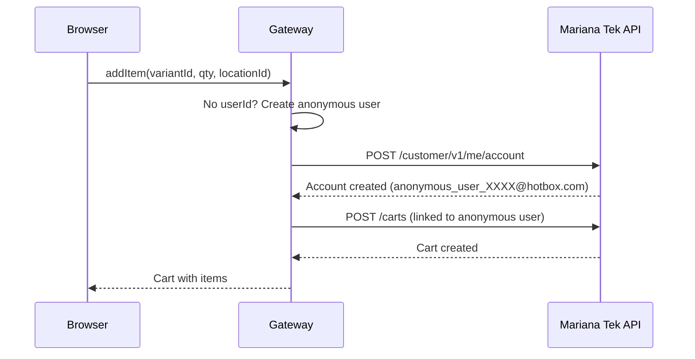
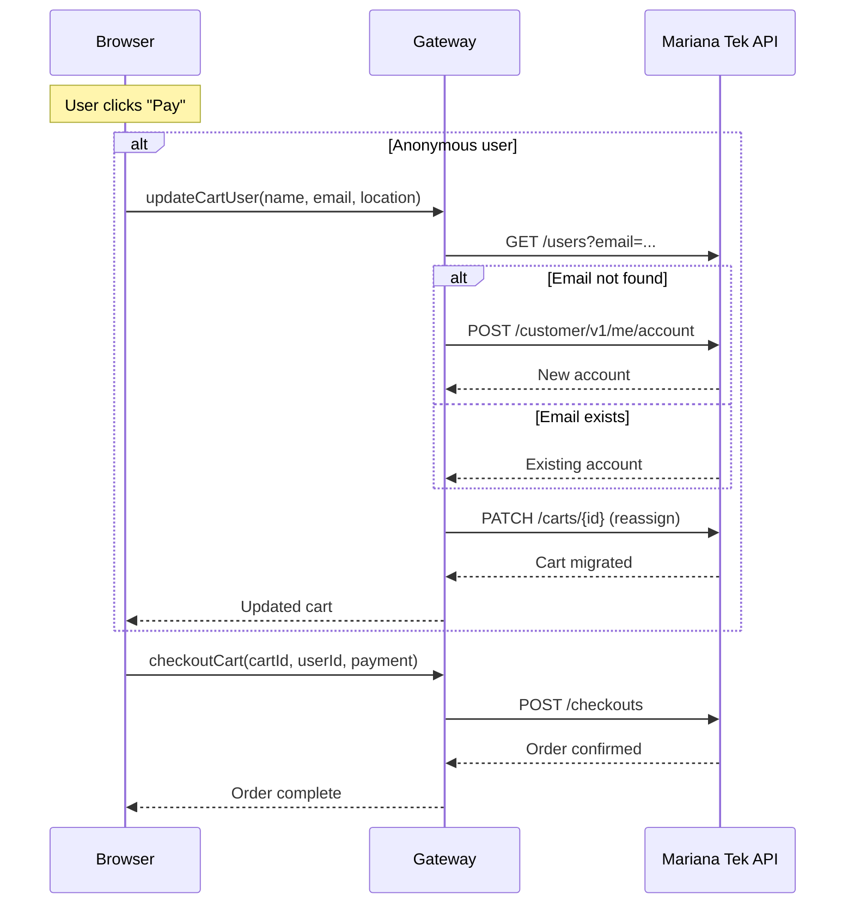

# Anonymous Checkout

Mariana Tek requires every user to log in and select a location before they can add anything to a cart. For a sauna business built on walk-in customers, this was a fundamental mismatch. We built a checkout flow where customers can browse, add to cart, and pay without ever seeing a login screen.

## What the Client Needed vs What Mariana Tek Requires

| What the Client Needed | What Mariana Tek Requires |
|------------------------|---------------------------|
| Walk-in customers must browse products, add to cart, and pay without creating an account | A user account must exist before any cart interaction. Create cart, add items, checkout: all require a `userId` |
| No location selection required for site purchases. Sales reporting must be separated by location: physical purchases track to their location, site purchases track to a corporate location | A location must be selected before any cart interaction. Products, pricing, and availability are all scoped to a specific location |

For a logged-in member, MT's requirements are already satisfied. For a walk-in customer, every client need runs directly into an MT requirement.

## The Core Idea

If Mariana Tek requires a user, we create one silently. If it requires a location, we use a fixed "Corporate Location" that the client sets up once and we hardcode in the frontend. All purchasable products are made available at this location alongside the real physical locations.

The full flow has two phases: **browsing** (adding items with a temporary identity against the corporate location) and **checkout** (swapping that temporary identity for the customer's real one). The customer's real identity is only needed at payment time. Until that point, the temporary account carries the cart, keeping the browsing experience completely frictionless.

## Phase 1: Browsing with a Temporary Identity

When a visitor clicks "Add to Cart", the frontend calls `createCart` with the corporate location ID. The gateway sees no `userId`, creates a temporary Mariana Tek account behind the scenes, and returns a cart owned by that account. From the customer's perspective, a cart appeared with no login prompt and no location picker.

## Phase 2: Checkout with a Real Identity

When an anonymous customer reaches the checkout page, they see a simple form. (Logged-in users see their saved payment methods instead.)

On "Pay", the frontend first calls `updateCartUser` with the customer's details. (Logged-in users skip this step entirely: their cart is already owned by their real account, so they go straight to payment.) The gateway resolves a real identity:

- **New customer:** creates a fresh Mariana Tek account with the provided name and email.
- **Returning customer:** if the email matches an existing account, that account is reused.

## Payment Channels

Once the cart is migrated, the gateway supports two payment paths through a single checkout call:

- **Account balance.** If the resolved user has a Mariana Tek account balance (from gift cards or prepaid credits), it can be applied toward the cart total.
- **Bank card.** A saved card can be charged directly, or a new card can be tokenized via Stripe and then processed through Mariana Tek.

If the balance covers the full amount, no card is needed at all. If not, the remaining amount is charged to the selected card.
