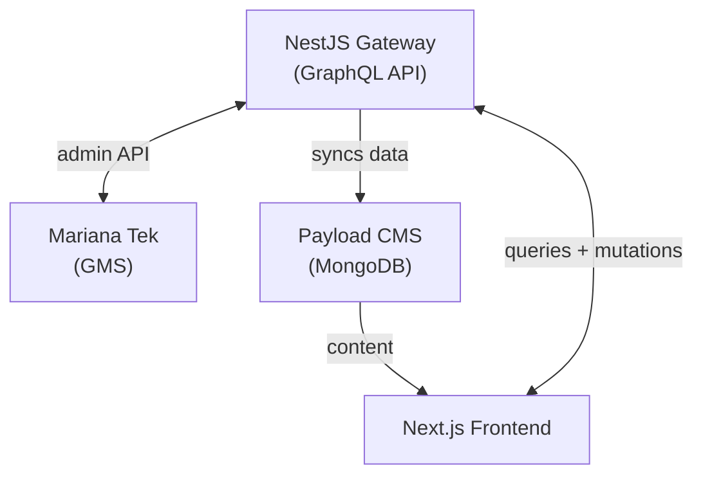
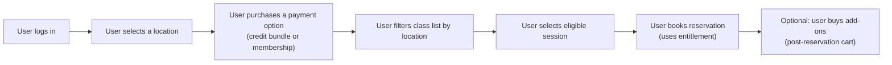

# The Hot Box Sauna: Custom Booking on Top of a Gym Management System

The Hot Box is a sauna business operating across multiple locations in Ireland. They needed to move their bookings and sales into Mariana Tek, a Gym Management System that handles class scheduling, reservations, memberships, and payments. The client wanted the operational backbone of a GMS with a premium customer experience.

I was the lead developer on this project over 6 months. The brief was to build a custom booking website on top of Mariana Tek that would let customers browse, book, and pay without the friction the platform enforces by default. That meant no mandatory login, no forced membership purchases, and no single-spot booking limitation. Walk-in customers had to move through the site as smoothly as members.

## The Architecture

A NestJS gateway sits between the Next.js frontend and Mariana Tek. It exposes a GraphQL API that the frontend consumes for all booking, cart, and checkout operations. The gateway also syncs relevant Mariana Tek data into Payload CMS, where editors manage marketing pages and site content.

The gateway exists to normalize Mariana Tek's API for the web experience. The GMS was built for gym staff workflows, not customer-facing booking flows. The gateway handles that translation: batching operations, hiding unnecessary API complexity, and enabling custom booking behavior without pushing that logic into the frontend.

## How Mariana Tek Works Out of the Box

To understand the features we built, it helps to see the default flow Mariana Tek expects every customer to follow:

Every step is mandatory. You cannot create a cart without logging in. You cannot browse classes without selecting a location. You cannot book a reservation without owning a membership or credit bundle. This flow works for a gym member who buys a monthly plan and books recurring sessions. It does not work for a walk-in sauna customer who wants to book a single session with friends and pay at checkout.

## Feature Breakdown

Three features were built to bridge the gap between what the client needed and what Mariana Tek allowed:

- **Enriched Content.** Mariana Tek stores operational data (schedules, instructors, class types) but offers limited presentation control. We built a sync pipeline that pulls this data into Payload CMS, where editors can enrich it with custom page layouts, imagery, and marketing content.

- **Anonymous Checkout.** Walk-in customers can browse products, add to cart, and pay without logging in or selecting a location. Temporary accounts and a fixed corporate location handle MT's requirements behind the scenes, swapped for the customer's real identity only at payment time.

- **Reservation Flow.** Customers can book one or more spots in a session without owning a membership or credit bundle. Single-seat credits are allocated on the fly, group bookings are handled in a single checkout, and the reservation is processed through an atomic queue. Add-on products are folded into the same checkout instead of requiring a separate post-reservation purchase.
